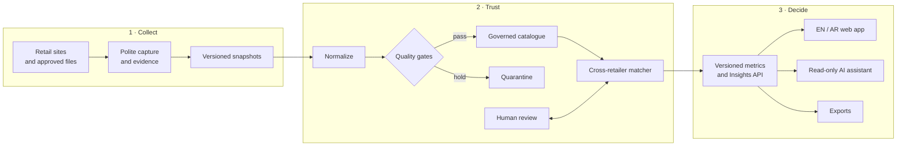

<p align="center">
  
</p>

<h1 align="center">Product Intelligence</h1>

<p align="center">
  <strong>Turn fragmented retail catalogues into evidence-backed decisions.</strong>
</p>

<p align="center">
  One governed intelligence layer for products, prices, promotions, availability, launches,
  cross-retailer matching, and AI-assisted analysis.
</p>

<p align="center">
  <a href="https://github.com/muttonkodibiriyani/product_intelligence/actions/workflows/ci.yml"></a>
  
  
  
  <a href="LICENSE"></a>
</p>

---

Retail intelligence is usually scattered across spreadsheets, screenshots, isolated crawls, and
numbers that cannot be traced back to their source. Product Intelligence turns that noise into a
single, explainable view of the market.

The current pilot brings together **Ulta Beauty, Sephora Middle East, and Faces in the UAE**, with
the platform designed to expand across KSA, more Alshaya brands, more retailers, and more product
categories without rebuilding the core.

> **The advantage is not another dashboard. It is knowing which decisions the data can support —
> and refusing to invent an answer when it cannot.**

## What it unlocks

| Business question | Product Intelligence answer |
|---|---|
| Where are we more expensive on the same item? | Governed product matches, current and regular prices, unit-price comparisons, and review flags |
| Which brands or categories are missing from our range? | Coverage-aware assortment gaps and retailer exclusives |
| Which promotions are real and worth reacting to? | Evidence-backed markdowns, discount depth, offer context, and visual product results |
| What launched, disappeared, or changed? | Versioned snapshots, first/last-seen history, availability states, and launch readiness |
| Are two differently named listings actually the same product? | Brand aliases, normalized attributes, size and concentration rules, and image-assisted matching |
| Can leadership ask follow-up questions without learning the schema? | A read-only AI assistant grounded in the same metrics and evidence as the dashboard |
| Can we trust the number? | Every metric carries scope, coverage, caveats, version, and a route back to source evidence |

## The product today

The repository is no longer a foundation skeleton. It contains an end-to-end pilot spanning data
capture, governed datasets, matching, metrics, APIs, and a production-grade interface.

### Decision workspace

- **Executive overview** — catalogue scale, price position, promotion depth, availability, and
  launch signals at a glance.
- **Product explorer** — image-first search and filtering across retailers, brands, categories,
  price bands, and availability.
- **Product detail** — retailer offers, attributes, images, history, provenance, and honest missing
  states.
- **Head-to-head comparison** — matched items, price gaps, category position, basket summaries,
  and exportable rows.
- **Promotions and launches** — retailer-aware views that distinguish measured facts from partial
  or not-yet-supported data.
- **Pricing intelligence** — price ladders, unit economics, gaps, outliers, and actionable
  suggestions.
- **Insights API** — brand price policy, assortment white space, stock-out observations, and size
  traps; its dedicated dashboard rollout is in progress.
- **AI assistant** — cited, read-only answers over the governed metric layer rather than a separate
  copy of the data.
- **English and Arabic** — first-class locale support, RTL layouts, accessible charts, and responsive
  desktop/mobile experiences.

### Intelligence engine

- Captures public catalogue and offer evidence with polite, source-specific collection controls.
- Normalizes money, size, pack, shade, concentration, promotion, availability, and retailer context.
- Preserves observations and source history instead of silently overwriting yesterday's truth.
- Matches products across retailers as `exact`, `family`, or `substitute`, with hard constraints
  that a similarity score cannot override.
- Computes one versioned set of metrics for the API, web app, exports, and assistant.
- Withholds misleading results when coverage is partial, a cohort is too small, or evidence is
  missing.

## How it works



The same governed path feeds every surface. There is no separate spreadsheet formula for the
dashboard, another one for exports, and a third one for AI.

## Trust is a feature

Product Intelligence is deliberately conservative because a confident wrong answer is worse than
an honest gap.

- **Missing is not zero.** Unknown, unsupported, partial, blocked, and not observed are distinct
  states.
- **A wrong match is worse than no match.** Size, concentration, shade, pack type, gender, refill,
  tester, and edition rules remain hard constraints.
- **Evidence survives the metric.** Results remain traceable to their source listing, observation,
  and image.
- **Partial crawls cannot masquerade as market share.** Cohort and coverage gates determine which
  calculations may be shown.
- **Money is exact.** Currency values use `Decimal`, never binary floating point.
- **The system fails closed.** Authentication, API errors, secret scanning, and deployment checks
  are designed to stop safely.

## Current build status

| Layer | Status | Notes |
|---|---|---|
| Foundation and governed datasets | **Operational** | Typed domain models, dataset contracts, evidence metadata, PostgreSQL/pgvector, migrations |
| Three-retailer pilot collection | **Operational** | Ulta, Sephora, and Faces snapshots; collection cadence and source hardening continue |
| Metrics and secure API | **Operational** | Versioned FastAPI contract for catalogue, comparison, promotions, launches, pricing, coverage, and insights |
| Bilingual decision workspace | **Operational** | Next.js static application with Firebase authentication, EN/AR, RTL, mobile, and desktop coverage |
| Cross-retailer matching | **Beta** | Deterministic three-retailer engine is implemented; gold-set and governed publishing workflows are being completed |
| Image similarity | **In development** | Placeholder detection, perceptual hashes, and CPU SigLIP signals feed review rather than silently forcing matches |
| Recurring collection and sign-off | **In development** | Cost-controlled scheduling, alerts, broader history, and final owner UAT |

See the [full blueprint](docs/blueprint.md), [architecture overview](ARCHITECTURE.md), and
[decision log](docs/decision-log.md) for the design and its trade-offs.

## Technology

| Area | Stack |
|---|---|
| Data and services | Python 3.12, FastAPI, Pydantic, PostgreSQL 16, pgvector, Alembic |
| Collection | httpx, Playwright, source-specific capture tools, immutable evidence manifests |
| Matching | deterministic rules and text signals; perceptual-hash and CPU SigLIP signals are in active development |
| Web | Next.js 16, React 19, TypeScript, Tailwind CSS, TanStack Query, Apache ECharts |
| Identity and runtime | Firebase Auth, Firebase Hosting/App Hosting, Cloud Run |
| AI | Gemini through a constrained, read-only tool layer with evidence-aware responses |
| Quality | pytest, Hypothesis, mypy strict, Ruff, Vitest, Playwright across Chromium/Firefox/WebKit, ESLint, gitleaks |

## Quick start

### Requirements

- Python 3.12
- [uv](https://docs.astral.sh/uv/)
- Node.js 22 and npm
- Docker
- Java 11+ for Firebase emulators

### Python workspace and local data services

```bash
make install

# Full Python quality gate against an isolated PostgreSQL + pgvector test database
make test-db
make check
make test-db-down

# Persistent local development services
cp .env.example .env
make up
make migrate
make emulators
```

The emulator suite uses a `demo-*` Firebase project id and cannot reach the real cloud project.

### Web application

```bash
cd apps/web
npm ci --ignore-scripts
npm run typecheck
npm test
npm run build
npm run dev
```

### Local ports

All services bind to `127.0.0.1`.

| Service | Port |
|---|---:|
| PostgreSQL + pgvector | 55432 |
| Auth emulator | 59099 |
| Firestore emulator | 58080 |
| Storage emulator | 59199 |
| Emulator UI | 54000 |
| Emulator hub | 54400 |
| Emulator logging | 54500 |

## Repository map

```text
apps/
  web/                  Next.js decision workspace (EN/AR, desktop/mobile)
  assistant/            Gemini assistant, tools, policies, and evaluations
packages/
  pi_api/               authenticated, versioned FastAPI service
  pi_capture/           capture contracts and source-run tooling
  pi_connector_ulta/    Ulta connector and normalization boundary
  pi_core/              shared types, money, contexts, and invariants
  pi_dataset/           governed dataset contracts and serialization
  pi_db/                PostgreSQL schema, migrations, and repositories
  pi_fetch/             polite HTTP fetching, retries, and block handling
  pi_match/             normalization and cross-retailer matching engine
  pi_metrics/           coverage-aware business metrics and insights
  pi_profiles/          source and market profiles
docs/
  adr/                  architecture decision records
  contracts/            OpenAPI contract, examples, and golden responses
  requirements/         requirement-to-test traceability
  runbooks/             guarded release and operations procedures
infra/                  local stack, Firebase policy, and deployment support
tools/                  capture, import, analysis, and verification utilities
```

## Engineering quality bar

Every change is expected to pass seven independent CI lanes: Python lint/types/tests, database
migrations and schema tests, Firebase rules, dependency audit, secret scanning, reproducible web
build, and the full Next.js suite including EN/AR E2E across three browser engines.

Start with:

- [Contributing guide](CONTRIBUTING.md)
- [Security policy](SECURITY.md)
- [Architecture decisions](docs/adr/)
- [API contract](docs/contracts/pi-api.openapi.json)
- [Requirement traceability](docs/requirements/traceability.csv)

## License

[MIT](LICENSE) © 2026 muttonkodibiriyani
