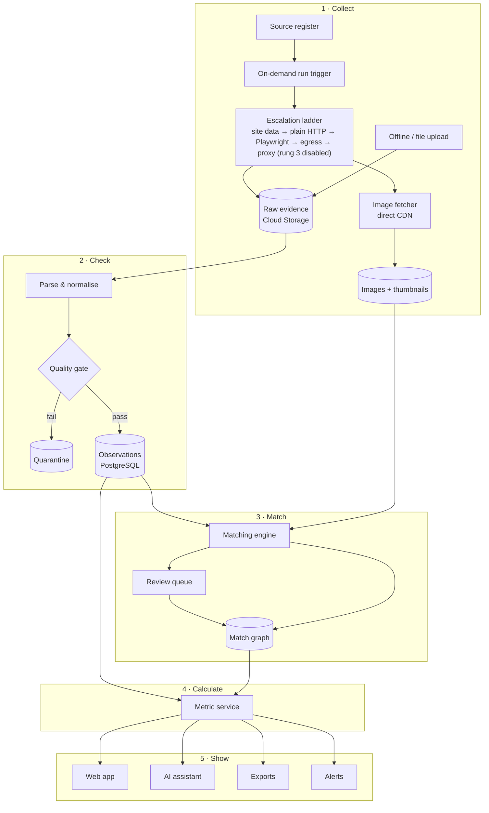

# Product Intelligence — Blueprint v1.1

**Status:** approved for build · **Date:** 30 Sep 2026 · **Owner:** Tarkesh
**Cloud:** Firebase project `productintelligence-beeb3` (Blaze, $25 budget)
**Reference requirements:** *Alshaya Global Product Intelligence Requirements v1.0* (162 requirements, 32 KPIs, 89 fields, 36 UAT scenarios). IDs such as SCP-/SRC-/MAT- refer to that register (see `docs/requirements/traceability.csv`). The register is used as a **quality and design checklist**, not as a limit on data collection.

> **v1.1 decisions (owner, 30 Sep 2026).**
> - Maximum coverage: every product, every variant, every visible field, all images.
> - Collection uses an **automatic escalation ladder**, on by default (ADR-0003).
> - **Proxy last.** Every free method is exhausted first, with a per-source report. The owner decides and buys.
> - **Market fallback KSA → UAE** (ADR-0004).
> - Image pipeline and image-first frontend. Tor excluded for technical reasons.

---

## 0. Summary

A competitive product and price intelligence platform. It collects **complete public catalogues** (every product, variant, field and image) from competitor and Alshaya-brand online stores, keeps every observation (append-only history), matches identical and comparable products, and presents image-first analytics in a login-protected web app with an AI assistant.

**Pilot:** Ulta Beauty (Alshaya) vs Sephora · KSA (fallback UAE) · 2026. Food (Shake Shack…), apparel (American Eagle…) and more beauty brands (Charlotte Tilbury…) plug in later without redesign.

**Five stations**

1. **Collect.** Robots capture a baseline snapshot once, then refresh only on demand. Within a run, the method escalates automatically through rungs 0–4 when a site resists; rung 5 only by owner decision (§6.3).
2. **Check.** Values are cleaned and tested; suspicious data goes to quarantine, never to reports.
3. **Match.** Identical and comparable products are linked; uncertain cases go to a person.
4. **Calculate.** One set of tested formulas produces every number.
5. **Show.** Dashboards, visual compare board, alerts, AI chat and exports all read from station 4.

**Guiding promise.** No system "never fails". This one **fails safely**: it never publishes wrong data silently, one broken source never breaks the others, and accuracy is measured and shown rather than claimed.

---

## 1. Scope

### 1.1 Pilot

| Item | Detail |
|---|---|
| Alshaya brand | **Ulta Beauty**: Kuwait (Nov 2025), UAE (Mall of the Emirates Jan 2026, Dubai Mall Mar 2026), KSA (Red Sea Mall, Jeddah, May 2026) |
| Competitor | **Sephora Middle East** (`sephora.me`, KSA + UAE, EN + AR), plus app data where reachable |
| Markets | KSA (SAR, VAT 15%) first; UAE (AED, VAT 5%) as fallback and second market |
| Coverage | Full catalogue: every category and variant, all visible fields, all images |
| Channel | Online (web/app); offline store audits importable |
| Cadence | **One-time baseline snapshot per source, then on-demand refreshes only** (owner decision 2026-09-30, cost). No automatic daily/weekly schedules. Images fetched once per distinct URL/content hash, never re-downloaded |

### 1.2 Discovery item (week 1)

Ulta's Middle East roll-out has been **store-led**, and no Ulta ME e-commerce storefront is confirmed yet.

- **(a)** A storefront exists → full connector.
- **(b)** No storefront → Ulta prices come from Alshaya price files or store audits. Sephora is benchmarked against the **brands Ulta stocks**. Ulta US data may be used as a reference catalogue, labelled non-ME.
- **(c)** A mix of both.

### 1.3 Out of scope

- Account logins; bypassing passwords, paywalls or member-only areas.
- Orders or cart manipulation; automated repricing.
- Sales or market-share claims; forecasts without internal data; grocery.

### 1.4 Market fallback (ADR-0004)

- Every source is tried for **KSA first**, through all free ladder rungs.
- If KSA can't be collected reliably, the source **switches to UAE automatically** and the pilot continues.
- KSA stays `pending` with its reason on the coverage screen and is retried on demand (no recurring retry).
- Where both work, both are collected, and KSA vs UAE analytics are enabled.

---

## 2. Design principles

1. Capture everything visible; record what couldn't be captured, and why.
2. Append-only history; corrections are new versions.
3. Context is part of the price: country, channel, location, locale, device, cohort, seller.
4. Missing is not zero: explicit availability states, and null + reason for fields.
5. One source of numbers for UI, API, exports and AI.
6. Governed matches: classes, confidence, lock/reject, versions.
7. Quarantine before publish.
8. Every number traceable to its evidence and image in two clicks.
9. Cost-aware: free first, proxy last, no paid resource without owner approval.
10. Honest coverage per source and field.

---

## 3. Architecture

### 3.1 Picture



### 3.2 Components

| # | Component | Responsibility | Runs on |
|---|---|---|---|
| C1 | Source register | Source contexts, cadence, current ladder rung, coverage status, first-history date | PostgreSQL + admin UI |
| C2 | Orchestrator | On-demand runs (no schedules enabled), retries, per-source isolation, run manifests | Dagster |
| C3 | Connectors + ladder | One package per source; automatic method escalation (§6.3) | Our server first; Cloud Run jobs |
| C4 | Evidence store | Raw responses/snapshots with hash (90 days) | Cloud Storage |
| C5 | Image pipeline | Download, dedupe, resize, embeddings, swatch colour | Job + Cloud Storage |
| C6 | Normaliser | Price, currency, tax, size/pack, shade, concentration, promotions | `pi_normalize` |
| C7 | Quality gate | Schema, anomaly, reconciliation, freshness → accepted/warning/quarantined | Pandera + dbt |
| C8 | Fact store | Catalogue, variants, observations, content, reviews, promotions, matches, audit | Cloud SQL PostgreSQL 16 + pgvector |
| C9 | Matching engine | Five-stage pipeline (§8) | `pi_match` |
| C10 | Review queue | Accept/reject/lock/split/merge; gold set | Web app (+ Label Studio) |
| C11 | Metric service | Versioned KPIs, point-in-time aware | Cube + dbt |
| C12 | Web app | Image-first explorer, product page, compare board, studio, alerts, coverage, health, admin; EN + AR | Next.js on App Hosting |
| C13 | AI assistant | Read-only metric tools, cited answers with images | Genkit + Gemini |
| C14 | Alerts | Price/promo/stock/launch/content rules, dedupe, ack | Job + Firestore + email |
| C15 | Identity & access | Login, MFA, roles, SSO-ready | Firebase Auth + Identity Platform |
| C16 | Exports | CSV/Excel/Parquet with manifests | Cloud Storage |
| C17 | Observability | Run health, escalations, block rates, drift, match quality, cost | OpenTelemetry, Cloud Logging, Sentry |
| C18 | Secrets | Proxy and API credentials | Secret Manager |

### 3.3 Environments

| Env | Where | Cost |
|---|---|---|
| local | Our server: Docker Compose (PostgreSQL + pgvector, Dagster, Cube) + Firebase emulators. Crawling runs here first | $0 |
| dev | Firebase `productintelligence-beeb3` | within budget |
| prod | Same project (separate DB/site) at first | approved per step |

---

## 4. Technology (open source first)

| Layer | Choice |
|---|---|
| Languages | Python 3.12 (data, crawling, matching); TypeScript (web, AI) |
| Packaging | uv workspace; pnpm |
| Fetch | httpx (plain HTTP, no impersonation; ADR-0006) |
| Browser | Playwright (Chromium/Firefox/WebKit), Crawlee for Python |
| Stealth | Not used: rung 3 is disabled (ADR-0006) |
| Proxy | KSA/UAE residential/mobile, only after free rungs fail (owner buys) |
| Extraction | extruct, selectolax, parsel, jmespath; Gemini structured output as fallback |
| App data | mitmproxy on our own device/emulator, when the web lacks data |
| Orchestration | Dagster |
| Validation | Pydantic v2, Pandera, dbt-core |
| Units/money | Pint, Decimal, Babel |
| Database | PostgreSQL 16, pgvector, pg_partman |
| Images | Pillow/pyvips, imagehash, SigLIP |
| Matching | Splink, RapidFuzz, BGE-M3, SigLIP, Gemini judge |
| Labelling | Label Studio |
| Semantic layer | Cube |
| Web | Next.js, shadcn/ui, Tailwind, TanStack Table/Query, Apache ECharts, dnd-kit, next-intl |
| AI | Genkit + Gemini; promptfoo evals |
| Tests | pytest, hypothesis, Playwright Test, Vitest |
| Lint/types | Ruff, mypy --strict, ESLint, tsc, Prettier, sqlfluff |
| CI | GitHub Actions; gitleaks |

**Excluded: Tor.** It rarely exits in KSA/UAE, is slow, and is widely blocked by retail CDNs.

---

## 5. Data model

The chain is **product family → variant → source listing → offer observation**. Content, reviews and images attach to listings and variants. Matches connect variants but never merge histories.

### 5.1 Main tables

```
source(id, name, kind[web|app|feed|aggregator|offline], base_url, notes)
source_context(id, source_id, country, channel, location_context, locale, time_zone, device, cohort,
               refresh_policy, ladder_rung_current, ladder_rung_max_allowed, coverage_status,
               fallback_of, history_start_at, valid_from, valid_to)
crawl_run(id, source_context_id, connector_version, ladder_rung_used, started_at, finished_at, status,
          discovered, fetched, parsed, accepted, quarantined, blocked_count, bytes_via_proxy, manifest_uri)
evidence(id, crawl_run_id, url, content_hash, storage_uri, retrieved_at, http_status, retention_until)

brand(id, name, name_ar, aliases[])
product_family(id, brand_id, name_normalized, category_universal_id, created_at)
variant(id, family_id, gtin, mpn, shade, shade_code, shade_family, shade_hex, finish,
        size_value, size_unit, pack_count, concentration, formulation, is_refill, is_mini, is_set,
        set_contents jsonb, attributes jsonb, attr_provenance jsonb, successor_variant_id)
source_listing(id, source_id, source_listing_key, source_sku, variant_id, url,
               name_original, name_ar, lang, category_path_source, first_seen_at, last_seen_at)

listing_content(listing_id, observed_at, description, description_ar, ingredients, how_to_use,
                benefits, claims[], badges[], labels jsonb, content_hash)
image(id, content_hash, storage_uri, thumb_uri, width, height, phash, embedding vector)
listing_image(listing_id, variant_id, image_id, role[main|alt|swatch|model|texture], position,
              source_url, first_seen_at, last_seen_at)

offer_observation(  -- append-only, monthly partitions
  observation_id, crawl_run_id, source_context_id, source_listing_id, variant_id, seller_id,
  observed_at, ingested_at, recorded_at, source_effective_from, source_effective_to,
  price_current, price_regular_stated, price_promo, price_member, price_type, currency,
  installment jsonb, tax_status, unit_price_derived, unit_basis, availability_state,
  available_variants, low_stock_flag, delivery_promise, rating_value, rating_count,
  rank_in_category, rank_in_search jsonb, badges_at_time[], field_state jsonb, evidence_id,
  quality_status, correction_of)

review(id, listing_id, source_review_id, rating, title, body, lang, posted_at, verified_flag,
       helpful_count, attributes jsonb)  -- no reviewer names / PII
review_summary(listing_id, observed_at, rating_histogram jsonb, themes jsonb)

promotion(id, source_context_id, mechanic, rule jsonb, qualifying jsonb, min_spend, min_qty,
          eligibility jsonb, stacking, code, gift_with_purchase jsonb, advertised_from, advertised_to,
          first_seen_at, last_seen_at, terms_original, banner_image_id, evidence_id)
offer_promotion(observation_id, promotion_id)

match_edge(id, variant_a, variant_b, match_class, score, rationale jsonb, algo_version,
           review_state, reviewer, reviewed_at, valid_from, valid_to)

taxonomy, taxonomy_map, fx_rate, cohort, metric_def, alert_rule, alert_event,
audit_log, decision_log, user_entitlement
```

### 5.2 Rules

- Observations are insert-only; corrections use `correction_of`.
- Replays are idempotent (logical key + batch manifest).
- Money is `numeric(18,4)` + currency, never float. Implemented in `pi_core.Money`.
- Availability: `in_stock, low_stock, out_of_stock, not_deliverable, removed, not_observed, blocked, unknown`.
- Field null reasons: `not_published, not_applicable, restricted, parse_failure, blocked, unknown`.
- Content, images and reviews are versioned by hash.
- Point-in-time views: `as_observed(ts)` and `as_known_at(ts)`.

### 5.3 Beauty extension

Shade, shade code/family/hex, finish, coverage, skin type/concern, SPF, size value/unit (original kept), pack count, concentration (EDP/EDT/parfum/cologne/extrait), fragrance family/notes, formulation, refill/mini/set + contents, gender, limited edition, retailer exclusive, clean/vegan/cruelty-free claims. Mass↔volume is never auto-converted.

---

## 6. Collection

### 6.1 Onboarding

1. **Add source:** URL, markets, locales.
2. **Safe URL check.**
3. **Recon:** embedded JSON (`__NEXT_DATA__`, JSON-LD, state blobs), the site's own search/catalogue APIs (Algolia, SFCC OCAPI, Constructor, Bloomreach, GraphQL), sitemaps, category trees, app API.
4. **Build:** connector + fixtures.
5. **Trial run:** reconcile counts against the site's own totals.
6. **Publish:** coverage status and gaps.

### 6.2 Connector interface

```
discover(context) -> listing refs        # per run (baseline or on-demand): sitemaps, category trees, search paging, brand pages
fetch(ref, context, rung) -> evidence    # raw bytes + metadata; rung chosen by the ladder
parse(evidence) -> ListingRecord[]       # pure; every variant, field, image URL, review page
```

- Variant walking captures variant-level price and stock.
- Reviews: full first pass, then incremental.
- Category and search rank are captured.
- Both EN and AR locales are collected.

### 6.3 Escalation ladder (ADR-0003, amended by ADR-0006)

| Rung | Method | Cost |
|---|---|---|
| 0 | Site's own JSON/API, embedded data, sitemaps | $0 |
| 1 | Plain HTTP (httpx), normal headers, session reuse; no TLS/JA3/HTTP2 impersonation (ADR-0006) · `plain_http` | $0 |
| 2 | Playwright real browser (headless → headed via Xvfb), no stealth patches (ADR-0006), human pacing · `playwright` | $0 |
| 3 | **Disabled** (ADR-0006): never attempted or recorded. No stealth browsers, fingerprint rotation or cookie reuse; number reserved, refused in `pi_core` and by DB CHECK | — |
| 4 | Egress variation: our server vs Cloud Run (incl. `me-central1/2`) | $0 |
| 5 | KSA/UAE residential/mobile proxy, **only after rungs 0, 1, 2 and 4 fail, the source is marked blocked and a Proxy Decision Report is sent; owner decides and buys** (ADR-0006) · `residential_proxy` | $ |

- **Memory:** each context remembers its working rung and periodically tries cheaper rungs again.
- **Block detection:** 403/429, challenge-page signatures (Akamai, Cloudflare, PerimeterX, DataDome), empty or odd payloads, count drops.
- **Before rung 5:** a **Proxy Decision Report** per source (attempts, evidence, GB and $ estimate).
- **Keeping proxy use small:** only JSON/API calls go through it; images are fetched directly from CDNs; ETag and caching are used.
- **Hard lines:** no logins, no paywall bypass, no cart/checkout; human-like pacing (~1 req/s/source, jittered, adaptive back-off).
- **Market fallback** per §1.4.

### 6.4 Cadence

Owner decision 2026-09-30 (cost): collection is **one-time and on-demand**, not scheduled.

| Job | Frequency |
|---|---|
| Baseline snapshot | Once per source. Sephora UAE: 30 Sep 2026 full snapshot. Ulta UAE: blocked; **only if** the owner approves rung 5 via the Proxy Decision Report (#19), after the legal/ToS review and an ADR-0006 amendment (rung 5 is JSON/API only today), a ~20-page test and then one full-catalogue snapshot |
| Price/stock/promo refresh | **On demand only**, when the owner asks, for a chosen site or category |
| Full discovery + content | On demand only |
| Images | Fetched once per distinct URL/content hash, never re-downloaded; a changed image (new URL or hash) is fetched and recorded, so image changes stay observable |
| Reviews | On demand only |
| Search ranks | On demand only |

- **No Cloud Scheduler jobs** (disabled or absent). No recurring crawl of any source.
- **On-demand trigger:** a `make`/CLI command (later an admin button) runs a refresh for a chosen site or category and records the run's cost in its run manifest.
- **Storage:** every snapshot is kept, append-only, in the DB and in the Firebase demo export, so history grows only when the owner chooses to refresh. Data is reused without re-crawling.
- **If rung 5 is ever approved, proxy traffic is kept minimal:** heavy assets are blocked in the browser, and images are fetched directly from the CDN, never through the proxy.

### 6.5 Images

1. Collect all image URLs (main, alternates, swatches, texture, model).
2. Fetch directly from the CDN.
3. Dedupe exact duplicates by SHA-256 and near-duplicates by pHash.
4. Store the original plus WebP versions at 800 px and 200 px.
5. Compute a SigLIP embedding; derive shade hex from swatches.
6. Serve via signed URLs.

Estimate: ~50k images ≈ 10 GB ≈ $0.20/month.

---

## 7. Normalisation and quality

### 7.1 Normalisation

- **Text:** original kept; NFKC and Arabic normalisation; transliteration for search.
- **Prices:** parsed with Babel (Arabic and Western digits) into `Decimal`. Currency comes from context.
- **Tax:** taken from evidence only; otherwise `unknown`.
- **Size/pack:** regex + Pint + LLM fallback, with provenance tagged.
- **Price types kept separate:** current, regular, promo, member, "from", instalment (Tabby/Tamara).
- **Promotions:** turned into structured rules; anything that can't be parsed becomes `unclassified`.
- **Claims and badges:** mapped to a normalised vocabulary.

### 7.2 Quality gate

| Check | Action |
|---|---|
| Schema/type | Quarantine |
| Price sanity (≤0, ×10/÷10, >5σ vs history/peers) | Quarantine + ticket |
| Discount >90% or regular < current | Quarantine |
| Count drop >20% vs last good run | Run `partial`; no removal/stock-out events |
| Block mid-run | `blocked`/`not_observed`, never out-of-stock |
| Missing critical field | Accepted with reason; excluded where required |
| Freshness | Watermark; stale flagged everywhere |

---

## 8. Matching

### 8.1 Classes

| Class | Meaning and use |
|---|---|
| Exact | Same brand, product, shade, size, concentration and pack. Used for price comparison |
| Family | Same product, different shade or size. Used for assortment |
| Size-normalised | Price per ml or g, with the size difference visible |
| Substitute / "dupe" | Human-approved alternative |

### 8.2 Pipeline

1. **Hard constraints:**
   - GTIN is validated.
   - Brand, size, concentration and pack must agree for exact.
   - Rejected pairs never return.
2. **Candidates:** GTIN, brand + name tokens, and pgvector kNN on BGE-M3 text (EN+AR) and SigLIP image embeddings.
3. **Splink** Fellegi–Sunter scoring over brand, name, size, shade (code/name/hex), category, image cosine and GTIN. The feature weights become the rationale.
4. **Gemini adjudication** for the borderline band only. Strict JSON; it can't override hard rules.
5. **Human review:** accept, reject, lock, split, merge. Locks survive model updates. There is no transitive exact identity.

### 8.3 Measurement

- **Gold set:** stratified, ≥600 pairs, double-labelled.
- **Reported per category:** precision, coverage, backlog and agreement, with 95% CIs.
- **Auto-accept thresholds** are set per category so that the precision lower bound is ≥98%.
- **CI regression gate:** no change may lower gold-set precision.

### 8.4 Beauty rules

- EDP ≠ EDT ≠ parfum.
- 50 ml ≠ 100 ml for exact matches.
- Minis, refills and sets are separate classes.
- The shade code must agree when present.
- Retailer-exclusive kits match only as family or substitute.

---

## 9. Analytics (pilot)

| Area | Analytics |
|---|---|
| Price | Exact gap, unit-price gap, fixed-basket index + trend, price bands, KSA vs UAE (pinned FX) |
| Promotions | Stated vs true markdown, promo share + mechanics calendar, gift-with-purchase, banner gallery |
| Assortment | Overlap/gaps, new/removed, shade/size breadth, exclusives, brands at Sephora not at Ulta |
| Availability | Stock-out, low stock, reappearance (unknowns separate) |
| Product changes | Shrinkflation ledger, content/claims changes, launch feed with images |
| Visibility | Category/search rank, badge share |
| Customer voice | Rating distribution, review volume and themes (no PII) |
| Content quality | Completeness score |
| Trust | Coverage, freshness, ladder rung per source, quarantine, match quality |

---

## 10. Web app (image-first)

1. **Home:** index trend, gaps, launches, promos, health.
2. **Visual explorer:** image grid, rich filters, EN/AR search, "find visually similar".
3. **Product page:** gallery + swatches, variants, side-by-side offers, price/stock history, promotions, content diff, reviews, match rationale, evidence.
4. **Compare board:** drag-and-drop; images, swatches, prices, unit prices, ratings, sparklines; save, share, export.
5. **Analytics studio:** templates with drill-through.
6. **Launch & change feed.**
7. **Match review queue.**
8. **Alerts inbox.**
9. **Coverage & health:** ladder rungs, block rates, cost-to-date.
10. **Admin:** users, roles, audit, kill switches.

**UX rules:** Arabic RTL, keyboard navigation, accessible charts, lazy images, explained empty states, p95 ≤3 s.

---

## 11. AI assistant

- **Stack:** Genkit + Gemini with read-only tools only: `search_products`, `get_product`, `compare`, `index_trend`, `promotions`, `assortment_gaps`, `launches`, `reviews_summary`, `coverage_status`.
- **Permissions:** it uses the user's permissions and has no free SQL.
- **Answers:** cite numbers, cohort, filters and cutoff, and show thumbnails. It says "not enough data" instead of guessing.
- **Safety:** scraped text is treated as data, never as instructions.
- **Briefings:** it drafts a weekly briefing.
- **Testing:** promptfoo suite (gold numbers, refusals, prompt injection) runs in CI.

---

## 12. Security

- **Login:** Firebase Auth + MFA; private app.
- **Permissions:** roles and attributes enforced in the API and PostgreSQL RLS.
- **Secrets:** Secret Manager only; gitleaks in CI.
- **Encryption:** at rest and in transit.
- **Audit:** logins, exports, roles, matches, escalations and proxy use.
- **Reviews:** no PII stored.
- **Crawlers:** isolated from DB admin credentials; content is never executed.

---

## 13. Cost ($25 budget)

A Google budget alerts but does not cap spending. Controls: alerts at 50/90/100%, a cost panel, and no paid resource without owner approval.

| Item | Est. monthly |
|---|---|
| Crawling: one baseline snapshot per source, then on-demand refreshes only (no schedules; each run records its cost) | $0–3 |
| Dev + CI | $0 |
| Auth / Firestore / Hosting | ~$0–1 |
| Storage (images + evidence) | ~$0.5 |
| Cloud SQL (smallest / trial; stopped when idle) | ~$0–10 |
| Gemini (Flash, cached) | ~$1–5 |
| **Subtotal without proxy** | **≈ $3–20** |
| Proxy (rung 5, only if approved via the report + ADR-0006 amendment): one ~20-page test + one full Ulta snapshot, heavy assets blocked, images direct | pay-as-you-go GB; one-off, estimate in the Proxy Decision Report |

---

## 14. Repository layout

```
docs/          blueprint, ADRs, requirements/traceability.csv, runbooks
packages/
  pi_core/        models, enums, money, units
  pi_fetch/       escalation ladder + block detection + proxy adapter
  pi_connectors/  sephora_me/, ulta_me/ (+ fixtures)
  pi_images/      download, dedupe, resize, embeddings
  pi_normalize/   price, tax, size, promo, claims
  pi_quality/     Pandera schemas, anomaly checks
  pi_match/       blocking, Splink, embeddings, Gemini judge
  pi_pipeline/    Dagster assets and jobs (on-demand; no schedules)
db/            migrations (Alembic), dbt/
semantic/      Cube metrics
apps/          web/ (Next.js), assistant/ (Genkit + promptfoo)
infra/         docker-compose, firebase.json, dataconnect/
tests/         uat/, e2e/
.github/       workflows, PR template
```

---

## 15. Engineering method

### 15.1 PR workflow

- Short-lived branches, small PRs, and `make check` locally before pushing.
- **Merge rule** (builder-enforced; GitHub Free private repos lack branch protection):
  1. Rebase on latest `main`.
  2. CI green on the rebased head.
  3. If `main` moved, rebase and re-run.
  4. Squash merge and delete the branch.
- Details in `CONTRIBUTING.md`.

### 15.2 CI gates

| Gate | Tools |
|---|---|
| Lint/format | Ruff, ESLint, Prettier, sqlfluff |
| Types | mypy --strict (src and tests), tsc |
| Tests | pytest + hypothesis (coverage ≥85%), Vitest |
| Connector fixtures | parse → expected JSON |
| Ladder tests | simulated blocks → correct escalation, no false stock-outs |
| DB | migrations up/down, dbt build + tests |
| Scenarios | tests/uat |
| Matching regression | gold-set precision/coverage |
| AI evals | promptfoo |
| Security | gitleaks, pip-audit, pnpm audit |
| E2E | Playwright vs emulators |

### 15.3 Runtime safety

- Per-source isolation, capped retries, failure queue.
- **Drift detection:** fill-rate or count shifts mark the run `partial` and raise an alert.
- **Self-repair loop:** alert → agent fix + fixture → CI → PR → merge → idempotent replay.
- Daily backups, weekly export, monthly restore drill.
- Kill switches per source, for all crawling, for the proxy and for the AI.

---

## 16. Delivery plan

| Milestone | PRs |
|---|---|
| **M0 Foundation (wk 1)** | PR1 skeleton + CI + docs · PR2 local stack · PR3 `pi_core` models · PR4 DB schema v1 · recon (Sephora data paths KSA/UAE, Ulta ME presence) |
| **M1 Collection (wk 2–3)** | PR5 `pi_fetch` ladder rungs 0, 1, 2 and 4 (rung 3 disabled, ADR-0006) + Proxy Decision Report · PR6 Sephora connector · PR7 Ulta/offline import · PR8 images · PR9 normalisation · PR10 quality gate · PR11 on-demand refresh trigger (no schedules) |
| **M2 Matching (wk 3–5)** | PR12 embeddings + blocking · PR13 Splink + rules · PR14 Gemini judge · PR15 review queue + gold set |
| **M3 Metrics + web (wk 5–8)** | PR16 dbt + Cube · PR17 app shell · PR18 explorer + product page · PR19 compare board · PR20 studio · PR21 feed + alerts · PR22 coverage/health + review UI |
| **M4 AI + hardening (wk 8–10)** | PR23 assistant · PR24 evals · PR25 exports · PR26 security + restore drill · PR27 deploy to dev (cost check first) |
| **M5 Sign-off (wk 10–12)** | Coverage report, precision report, field-accuracy audit (≥99%), demo |

---

## 17. Requirement checklist

- **127** register requirements are in pilot scope and **33** later.
- **2** are recorded owner deviations: SRC-08 and SEC-05, replaced by the audit-logged escalation ladder (ADR-0003).
- Full matrix: `docs/requirements/traceability.csv`.

---

## 18. Risks

| # | Risk | Mitigation |
|---|---|---|
| R1 | Ulta ME has no online store | Recon wk 1; Alshaya files, brand-overlap benchmarking, Ulta US reference |
| R2 | Sephora hardens protection | Ladder rungs 1–4; proxy report → owner decision |
| R3 | A formal Alshaya review flags the SRC-08 deviation | Decision recorded; audit log shows every collection method |
| R4 | $25 budget | Server-side crawling, free tiers, approvals, alerts |
| R5 | 98% match precision | Gold set, per-category thresholds, human review |
| R6 | Site redesigns | Fixtures, drift detection, self-repair loop |
