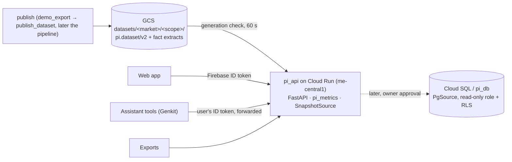

# Design: backend service layer (read API)

| | |
|---|---|
| Status | Proposed (design PR; implementation follows in the PRs listed in §12) |
| Owner | Deep Coder |
| Task | 01a0f488-eab6 |
| Consumers | Web app (FE), exports, AI assistant tools (`docs/design/ai-assistant.md`, #32) |
| Decisions it builds on | ADR-0002 (Firebase + Postgres), ADR-0007 (markets as data, dataset contract v2, scopes), the coordinator's metric ruling (below) |
| Deploys | Infra |

## 1. What and why

One **read API** is the single source of product and metric numbers for the web app, the exports
and the AI assistant. Today the dashboard and the assistant would each read `pi.dataset/v1` and
compute gaps and indexes themselves, so the same question could get two different answers.

**Coordinator ruling (binding):** the service layer computes every metric: price index and gaps,
promotions, assortment, availability and coverage. It uses Decimal money, counts only reviewed
pairs (§7.2), applies the n ≥ 5 rule, and returns explicit `not_enough_data` states (such as
`retailer_partial`). Everything else is a thin client:
- the dashboard;
- exports;
- the assistant's tools, which forward the user's ID token and map 1:1 onto endpoints.

There is **no metric code in TS**, not even a mirror. There is one implementation, in Python, tested
once.

**Out of scope:**
- writes. Review-queue actions, alerts, reports and admin changes come later, through separate
  audited endpoints;
- free-form queries. There is no SQL, no query strings and no arbitrary projection;
- live collection. The API never fetches from retailer sites.

## 2. Shape of the system



The code is split into packages. Each package depends only on the one before it:

| Package | Contents | I/O |
|---|---|---|
| `pi_core` (exists) | Money, currencies, markets, enums, listing and offer models | none |
| `pi_dataset` (PR-B) | pydantic models for `pi.dataset/v2`, the JSON Schema in `docs/contracts/`, a validator library, and a v1 → v2 read adapter | none |
| `pi_metrics` (new) | Pure metric functions over a loaded dataset: gaps, index, promotions, assortment, availability, coverage, and the cohort and absence rules | none |
| `pi_api` (new) | FastAPI app, auth, `DataSource` implementations, routers, the OpenAPI export | GCS, Firebase certs |

`pi_metrics` has no web or cloud imports, so the same numbers can be produced by a CLI, a notebook
or a batch export without the server.

## 3. Data path (v1: snapshots, no Cloud SQL)

Per the coordinator's direction, **Cloud SQL is not used now**. The API serves published,
versioned snapshots.

- **Source of truth for the API:**
  - `gs://<bucket>/datasets/<market>/<scope>/latest.json.gz` (`pi.dataset/v2`, ADR-0007 §6);
  - the immutable dated copies next to it;
  - optional fact extracts (`facts/observations.jsonl.gz` or Parquet) when the history outgrows
    one JSON document.

  The layout is the one ADR-0007 §6 fixes, so the §7 scope rules stay path-based.
- **Loading.** At cold start, `SnapshotSource`:
  1. lists the scopes the service is configured for (`PI_API_DATASETS=ae/pilot,…`, from the
     deploy config, not code);
  2. downloads each object;
  3. validates it with `pi_dataset` (the same library the publisher uses);
  4. builds in-memory indexes: by id, by brand, category and retailer, and a normalised EN/AR
     text key (case, diacritics, Arabic letter variants).

  A document that fails validation is **never served**. The previous good generation stays live,
  and if there is none the endpoint returns `503 data_unavailable`.
- **Freshness.** Each instance compares the object `generation` with the loaded one at most once
  every 60 s: one metadata GET. A new generation loads in the background and swaps in atomically,
  so readers see either the old dataset or the new one, never a mix. `meta.generation` and
  `meta.cutoff` are on every response.
- **No HTTP caching (S2, superseding the ETag plan).** Every `/api` response, errors included,
  is `Cache-Control: private, no-store` (hosting requirement 2), so there is no `ETag`/`304` and no
  `max-age`. Paging stays consistent through cursors bound to the generation (`409 stale_cursor`).
- **Size.** Today's pilot dataset is a few MB. The budget is ≤ 50 MB of JSON per instance; beyond
  that, history moves to the fact extracts and is read lazily per product. The instance has
  1 GiB (§6 exports, §9).
- **Transition.** Until the producers emit v2 (PR-B defines it, and Infra then switches
  `demo_export`/`publish_dataset`), `SnapshotSource` reads `datasets/uae/latest.json` (v1)
  through the read adapter in `pi_dataset`. The adapter maps the fixed `u`/`s` slots to register
  source keys **from the document's `meta.retailers[].key`**, never from literals. v1 support is
  removed when the dashboard moves to v2.
- **Swappable backend.** Routers and `pi_metrics` depend only on this protocol:

  ```python
  class DataSource(Protocol):
      def dataset(self, market: CountryCode, scope: str) -> LoadedDataset: ...  # validated, indexed
      def scopes(self) -> Sequence[ScopeRef]: ...
      def generation(self, market: CountryCode, scope: str) -> str: ...
  ```

  A later `PgSource` implements it against `pi_db` with a read-only role and RLS keyed on the
  user's claims. Cloud SQL costs about $10–15/month and **needs the owner's approval**; nothing in
  this design depends on it.

## 4. Auth

- **Token.** Every `/v1/*` call needs `Authorization: Bearer <Firebase ID token>`.
- **Verification.** The token is verified in-process against Google's public certificates, which
  are cached for their `max-age`. The checks are:
  - the signature (RS256), `aud = productintelligence-beeb3`, `iss`, `exp`/`iat`, and `auth_time`;
  - the custom claim `role ∈ {viewer, admin}` (set by `infra/scripts/invite_user.py`, #23).

  A missing or invalid token → `401`. A valid token without a known role → `403`.
- **The assistant forwards the signed-in user's token.** It never uses a service-account identity
  for data reads, so the user's own permissions apply to every tool call.
- **Roles:**

  | | viewer | admin |
  |---|---|---|
  | All read endpoints | ✓ | ✓ |
  | Admin-only fields: `evidence[].runId`, `evidence[].source`, coverage internals (rungs, run ids, block counts) | stripped | ✓ |
  | `/v1/matches?reviewState=proposed\|rejected` (the review queue view) | – | ✓ |

  Admin-only fields live in **separate response models**; they are not filtered out after the
  fact. A viewer response model does not have the field, so it cannot leak.
- **Scopes (ADR-0007 §7, built with PR-F).**
  - A `ScopeFilter` is derived from the `scopes` claim and applied inside the `DataSource` query
    layer, so every endpoint is covered by construction.
  - It is fail-closed once `PI_API_SCOPES_ENFORCED=true`: a viewer with no `scopes` claim sees no
    dataset.
  - `admin` or `scopes.all` gives full access.
  - Until PR-F exists, the flag is off, and behaviour matches today's Storage rules.
- **Revocation.** `check_revoked` is **off** by default. It would cost an extra Auth call per
  request, and ID tokens live one hour. Admin-only routes turn it on.
- **Abuse limits.** Each instance has a per-uid token bucket (default 10 req/s, burst 30; config).
  The bucket is **per instance**, so a user's effective ceiling is the limit × `max-instances`
  (3 → 30 req/s). That is accepted for the pilot; a global limit would need shared state
  (Firestore or Redis) and is not proposed. App Check can be added in front later if the owner
  enables it (as in the assistant design). Sizing: an assistant turn makes about 6 tool calls in
  a few seconds, well inside the burst of 30; a user running several turns back to back refills at
  10/s. A `429` carries `Retry-After`, and the assistant surfaces it rather than retrying in a loop.
- **CORS.** Same-origin through a Firebase Hosting rewrite (`/api/**` → the Cloud Run service), so
  the dashboard's CSP `connect-src 'self'` is unchanged (me-central1 confirmed, §11 Q1).

## 5. Conventions every endpoint follows

**Envelope** (agreed with the AI Assistant Engineer):

```jsonc
{
  "status": "ok" | "not_enough_data",
  "data": { ... },                       // always present when ok; MAY be present on not_enough_data
  "reason": "cohort_too_small",          // when not_enough_data
  "detail": {"en": "...", "ar": "..."},  // human text for the reason
  "cohort": {"description": "exact approved/locked pairs, same size, both priced", "n": 12},
  "caveats": [{"en": "Retailer X partial: 412 products loaded", "ar": "..."}],
  "evidence": [{"productId": "...", "retailer": "<source_key>", "url": "https://...",
                "capturedAt": "2026-09-30T20:42:00Z", "runId": "…admin only…"}],   // ≤ 20
  "meta": {
    "apiVersion": "1.1.0", "endpoint": "compare", "metricVersion": "2026-10-01.3",
    "generation": "1727…", "cutoff": "2026-09-30T00:00:00Z",
    "market": "AE", "currency": "AED", "scope": "pilot",
    "filters": { ... }                   // the validated, normalised input, echoed
  }
}
```

- `status`, `meta` and every `meta` field shown (including `metricVersion`) are **required** on
  every response. `reason` and `detail` are required exactly when `status = not_enough_data`.
- **`data` on `not_enough_data`.** The schema allows `data` with either status. When a summary is
  withheld but rows exist (compare rows with n < 5, index points, availability counts for a
  partial retailer), the response is `not_enough_data` **with** `data`, and the withheld part is
  `null`. Clients read `status` for the headline and `data` for the rows.

**The `not_enough_data` reasons** form a closed enum:
- `capability_off`
- `field_not_collected`
- `retailer_blocked`
- `retailer_partial`
- `cohort_too_small`
- `matches_unreviewed`
- `no_match`
- `not_in_scope`
- `currency_mismatch` (new: sides in different currencies, ADR-0007 §6; see §7.2)

An empty result is `ok` with `total: 0` only when the data was complete. Otherwise it is one of
these reasons. A missing value is never a zero.

**Errors** use a transport-level shape (not an envelope), `{"error": {"code": "...", "message": "..."}}`:

| Status | Code |
|---|---|
| 422 | `invalid_request` (malformed or unknown keys), `invalid_query` (well-formed but not answerable: an unknown retailer, a pair of one retailer, an empty date window, a cursor from other filters or another role), `ambiguous_dataset` |
| 401 | `unauthenticated` (`WWW-Authenticate: Bearer`; the only status that means sign in again) |
| 403 | `forbidden` (no role, admins only, or a viewer asking `/v1/matches` for unreviewed or rejected edges) / `out_of_scope` |
| 404 | `not_found` |
| 409 | `stale_cursor` (the cursor's generation is no longer loaded; restart paging) |
| 429 | `rate_limited` (with `Retry-After`) |
| 500 | `internal_error` (a generic JSON body with `no-store`; nothing about the failure is echoed) |
| 503 | `data_unavailable` (no dataset yet) / `auth_unavailable` (the signing keys can't be fetched); both send `Retry-After`; keep the session and retry |

No stack traces or dataset internals appear in messages.

**Money and numbers:**
- **Money** is `{"amount": "129.00", "minor": 12900, "currency": "AED"}` (ADR-0007 §6):
  - `amount` is a decimal **string** at the currency's ISO 4217 exponent (from `pi_core`, e.g.
    `"3.250"` KWD);
  - `minor` is an integer.

  A response in one market also carries `meta.currency`.
- **Every metric value** (percentages, indexes, rating averages, medians) is a decimal string
  matching `^-?\d+(\.\d+)?$`. Counts are integers. **No JSON floats anywhere.** A CI test walks
  the OpenAPI schema and fails on `type: number`.
- **Rounding** happens once, at the edge. The rule is half away from zero (`ROUND_HALF_UP` on
  `Decimal`):
  - money at the currency exponent;
  - percentages and indexes at 1 dp;
  - rating averages at 2 dp.

  Internal sums use unrounded Decimals.

**Source text:**
- Retailer text (brand, name, SKU, shade names, category labels, promo text) and text written
  by operators or the matcher (retailer `note`, `notObserved.why`, match `rationale`) are returned
  **raw**, with only control characters (C0/C1 except `\t\n`) stripped.
- Each such schema property carries the OpenAPI extension `x-pi-source-text: true`.
- The assistant treats every string not on its trusted list as untrusted, and escapes it.
- Evidence URLs are returned raw. Clients filter them to https plus their host allowlist.

**Input:**
- query models are strict; unknown keys give `422`;
- free text ≤ 120 chars;
- lists ≤ 25 values;
- `limit` ≤ 100 (default 25; the assistant caps itself at 25);
- cursor paging (`cursor` is opaque and bound to the generation, so a stale cursor gives `409
  stale_cursor`);
- dates are ISO-8601;
- enums are closed, in requests and responses: every enum is a JSON Schema `enum` list in the
  OpenAPI (reasons, statuses, review states, match classes, availability states, `cheaper`,
  `sort`, `format`, `view`). A new value is a minor `apiVersion` bump, announced to clients.

**Query encoding (pinned in the OpenAPI):**
- **An ordered pair** is `retailers=<base>,<other>`: one parameter, `style: form`,
  `explode: false`, exactly 2 items, order significant (first is the base). Source keys can't
  contain commas (`^[a-z][a-z0-9_]{1,62}$`). `/v1/compare` and `/v1/index` take it the same
  way; there is no POST body (S3: every route is `GET`, so the no-store, auth and OpenAPI
  rules stay uniform and a request fits in a URL).
- **Multi-value filters** (`brand`, `category`, `retailer`, `id`) repeat the key:
  `brand=A&brand=B` (`style: form`, `explode: true`), ≤ 25 values. Brand and category values may
  contain commas, so they are never comma-joined.
- **N-retailer endpoints** (coverage, availability, assortment) take the repeated `retailer`
  filter; they have no base/other.

**Parameters are data (ADR-0007):**
- `market` (ISO country), `scope`, `retailers` (register `source_key`s), `brand` and `category`
  are validated against the loaded dataset's own `markets[]`, `retailers[]` and taxonomy;
- `market` may be omitted only when the caller's visible datasets contain exactly one market;
- no source key, brand or country appears as a literal in `pi_api`/`pi_metrics`, enforced by the
  ADR-0007 literal guard test.

## 6. Endpoints (v1)

All endpoints are `GET` unless marked otherwise, and all are read-only. **One assistant tool
maps to one endpoint** (blueprint §11); the dashboard uses the same ones.

| Endpoint | Assistant tool | Purpose |
|---|---|---|
| `/v1/meta` | – | Markets, scopes, retailers (id, name, logo, country, status, since), capabilities, per-field status, taxonomy, and the cutoff and generation. Drives the pickers |
| `/v1/products` | `search_products` | Search and filter product cards |
| `/v1/products/{id}` | `get_product` | Card plus per-retailer offers, gap and match |
| `/v1/products/{id}/history` | – | Price, regular and promo series per retailer |
| `/v1/admin/products/{id}` | – | Admins only (`403` otherwise): `/v1/products/{id}` plus evidence `source` and `runId`, in separate models |
| `/v1/compare` | `compare` | Pair rows plus summary |
| `/v1/index` | `index_trend` | Fixed-basket price index points |
| `/v1/promotions` | `promotions` | Promo share and items |
| `/v1/assortment-gaps` | `assortment_gaps` | Present at one retailer, absent at another |
| `/v1/availability` | – | Stock-out and low-stock shares (unknowns separate) |
| `/v1/launches` | `launches` | First-seen items |
| `/v1/reviews-summary` | `reviews_summary` | Rating averages and counts |
| `/v1/coverage` | `coverage_status` | Per-retailer coverage and trust |
| `/v1/matches` | – | Match edges and rationale |
| `/v1/export/{view}` | – | CSV/JSONL of a view |
| ~~`/healthz`, `/readyz`~~ | – | Dropped in S2: no route is unauthenticated, and Cloud Run reserves some `…z` paths. Cloud Run uses a TCP startup probe; `503 data_unavailable` covers "no dataset yet" |

**Common filters** on the list and metric endpoints: `market`, `scope`, `retailers`
(`<base>,<other>`) or `retailer[]` (N retailers, for coverage, availability and assortment),
`brand[]`, `category[]`, `from`, `to`. The encodings are pinned in §5.

- **`/v1/products`:** `q`, `brand[]`, `category[]`, `retailer[]`, `matched`, `priceMin`,
  `priceMax` (decimal strings, in `meta.currency`), `sort=name|price_asc|price_desc|gap|gap_asc`,
  `limit`, `cursor`. Returns `{total, truncated, nextCursor, items: ProductCard[]}`.
  - A `ProductCard` has: `id`, `brand`, `name`, `category`, `size` (string plus unit), `image`
    (null until the contract carries it; never invented), per-retailer `price: Money | null`, and
    `match {class, reviewState, confidence}`.
  - With exactly two different `retailer` values (the first is the base) each card also carries
    `gap: PairGap` = `{base, other, gap {amount, pct, cheaper} | null, excludedReason | null}` for
    the latest date, from `pi_metrics.compare.pair_row`. Otherwise `gap` is null.
  - `sort=gap` and `sort=gap_asc` need that pair (else `422 invalid_query`). Both sort on the
    **signed** `gap.pct`, so the direction is kept (FE, 1 Oct). `gap` puts other dearest
    relative to base first; `gap_asc` puts other cheapest first. Uncounted cards come last in
    both, and ties and the tail are ordered by id.
- **`/v1/products/{id}`:** the card, plus `offers[retailer]`:
  - `price`, `regular`, `promoPct`, `rating{average, count}`, `size`, `shadeCount`, `sku`, `url`
    (as built: `evidence.url`, null unless it is https on one of that retailer's hosts in
    `PI_API_EVIDENCE_HOSTS`; the FE checks only the scheme),
    `early`, `capturedAt`, `availability`;
  - `gap {gapAmount: Money, gapPct, cheaper, convention} | null`, with `gapExcludedReason` when
    null;
  - `match {class, reviewState, confidence, rationale}`.
  - As built (S3): `pairs: PairGap[]`, one per unordered retailer pair the product is offered
    at (sorted ids, the first is the base), each with its gap or `excludedReason`. The same
    list is on the admin detail.
- **`/v1/products/{id}/history`:** `from`, `to`. Returns `series[retailer] = [{date, price, regular,
  promo, availability}]`. The trend needs `capabilities.history`, otherwise `capability_off`.
  Missing days are `null` with a `notObserved` window, never carried forward.
- **`/v1/compare`:** `retailers=<base>,<other>`, `id[]` (≤ 25), `brand[]`, `category[]`, `date`
  (default: the latest), `groupBy=brand|category`.
  - `rows[]`: `{id, name, brand, category, basePrice, otherPrice, gap {amount, pct, cheaper} |
    null, counted, excludedReason}`; `sides {base, other}` say which side is short.
  - `summary {n, medianGapPct, meanGapPct, cheaperCounts{<source_key>: n}, equalCount,
    basket {base, other}} | null`.
  - Rows are always returned. The summary follows the cohort rule (§7).
  - `limit` (optional, 1..500; API 1.1.0) cuts `rows` to the largest `|gap.pct|` first, rows
    without a gap last, then `id`. `total` counts every row and `truncated` says the list was
    cut. The summary, groups and sides are always over every row. Without `limit` the rows keep
    their usual order and `truncated` is `false`.
  - v1 compares one ordered pair. Only that pair's own edge counts: nothing is inferred
    through a third retailer (ADR-0007 §5). An N-retailer comparison is not in v1.
- **`/v1/index`:** `retailers {base, other}`, `brand`, `category`, `from`, `to`. Returns
  `{points: [{date, index, n}], trendAvailable, definition}`.
- **`/v1/promotions`:** `retailer[]`, `brand`, `category`, `minPct`. Returns
  `{promoShare{<source_key>: pct}, items[{id, name, retailer, price, regular, depthPct}], total,
  truncated}`. Needs `capabilities.promotions`. `limit` (optional, 1..500) keeps the deepest
  discounts: `depthPct` desc, then `id`, then `retailer`; shares are over every item.
- **`/v1/assortment-gaps`:** `missingAt`, `presentAt`, `brand`, `category`. Returns `{total,
  byBrand[{brand, count}], items: ProductCard[]}`, with the absence rules (§7).
- **`/v1/availability`:** `retailer[]`, `brand`, `category`, `date` (default: the latest).
  Returns, per retailer, a count for **every** blueprint state (`pi_core.AvailabilityState`):
  `inStock`, `lowStock`, `outOfStock`, `notDeliverable`, `removed`, `notObserved`, `blocked`,
  `unknown`. Shares use only the observed stock states (`AvailabilityState.is_known`: in, low
  and out of stock) as the denominator, and the response states that denominator.
  `notDeliverable` and `removed` are counted and reported, but **outside** the share denominator,
  like the unobserved states.
  - `notObserved`, `blocked` and `unknown` are never folded into out-of-stock or removed.
  - `removed` is reported only when the retailer's crawl for that date was **complete**
    (`status = supported`, no `notObserved` window covering the date and category). After a
    partial or blocked run the product is `notObserved`, and a caveat names the run.
  - A retailer that is `partial` or `blocked` for the date gets its counts plus
    `not_enough_data` / `retailer_partial` or `retailer_blocked` for the shares.
- **`/v1/launches`:** `retailer`, `since`, `category`. Returns `items[{id, name, retailer,
  firstSeen}], total, truncated}`. Needs two or more runs (`capability_off:history`). `limit`
  (optional, 1..500) keeps the newest: `firstSeen` desc, then `id`, then `retailer`.
  - A product is a launch on date *d* only if it was **not** seen at that retailer on the
    previous date *and* that previous run was **complete** for its category (`supported`, no
    `notObserved` window covering it). First-seen after a partial or blocked run is not a launch:
    the retailer's catalogue simply wasn't observed. Those items are withheld and counted in a
    caveat ("n items first seen after an incomplete run").
  - First-seen on the first date of the dataset is never a launch.
- **`/v1/reviews-summary`:** one of `id[]` (repeated, ≤ 25), `brand` or `category`. Returns `{n, avgRating, ratingCount}` per
  retailer. The rating distribution and themes → `field_not_collected`. There is no review text.
- **`/v1/coverage`:** `retailer[]`. Returns `retailers[{id, name, status, since, note,
  productCount, matchedCount, freshness, contexts[{id, channel, location, label, status,
  productCount, freshness, dates[{date, observed}]}]}]`, `capabilities`, `fields` and
  `notObserved`. Admins also
  get rungs, run ids and block counts.
- **`/v1/matches`:** `class`, `reviewState`, `retailers`, `brand`, `limit`, `cursor`. Returns
  `{total, nextCursor, items[{productId, brand, name, a, b, matchClass, reviewState, decidedBy,
  confidence, method, stage}]}`, ordered by product id then `(a, b)`. `retailers` filters an
  unordered pair here (edges are stored with `a < b`). A viewer asking for `proposed` or
  `rejected` gets `403 forbidden`, not an empty page. The cursor is bound to the generation,
  the filters and the role, so an admin's cursor is `422` for a viewer. The rationale text
  is not in the v2 dataset, so it isn't returned. The review states are the canonical `pi_core.ReviewState`
  set: `proposed`, `approved`, `rejected`, `locked` (there is no `accepted`, `auto_accepted` or
  `pending` state; "accepted" was the v1 UI label). Viewers see `approved|locked`; admins see all
  states. **`locked` stays distinct from `approved`** all the way from `pi_db` through v2 to here.
  The v1 exporter merged both into `accepted`; the v1 adapter maps that to `approved` and adds a
  caveat that locked edges can't be told apart in v1.
- **`/v1/export/{view}`:** `view ∈ {products, compare, index, promotions, assortment-gaps,
  coverage}`, one route each, taking that view's filters plus `format=csv|jsonl` (default `csv`).
  `/export/products` takes the `/products` filters and `sort` but not `limit` or `cursor` (`422`).
  - The rows are exactly the ones the view's endpoint returns, from the same call: products are the
    cards in `/products` order, unpaged; compare `data.rows`; index `data.points`; promotions and
    assortment-gaps `data.items`; coverage `data.retailers`.
  - **Row cap 50 000.** Over it the export is refused with `422 export_too_large`, never cut
    short. 50 k product cards encode in ~4 s (CSV) on a dev machine, well inside the 30 s timeout.
  - **Two exports at a time per instance.** Measured for 50 k product cards: ~164 MiB of row
    models plus ~58 MiB peak while encoding CSV (JSONL adds ~0), so ~4.4 KiB per row. With the
    app baseline (~66 MiB) and a budget-size dataset loaded (20 k products, 54 MiB JSON: 558 MiB),
    two concurrent exports of every product measured a peak of 800 MiB, inside 1Gi (runbook §6; 512Mi did not fit, decision
    log 2026-10-01). A slot is released exactly once, also when the client leaves before the
    response starts. A third concurrent export on the same instance gets
    `429 rate_limited` with `Retry-After: 5` instead of risking an out-of-memory restart.
  - **Line 1 is the manifest** (`schemaId: pi-api.export/v1`): view, format, row count, and the
    envelope minus `data` (status, reason, detail, cohort, caveats, and `meta` with cutoff,
    generation, filters, apiVersion, metricVersion). JSONL: `{"manifest": {...}}`, then one row
    object per line, serialised as the endpoint does. CSV: a UTF-8 BOM (so spreadsheets read
    Arabic), the manifest as **one quoted cell** `"# <manifest JSON>"`, a header row, then the
    rows. Quoting keeps every filter value inside that one cell, so a crafted filter such as
    `q=x,=HYPERLINK(...)` never becomes a cell of its own. Readers skip line 1 (pandas:
    `skiprows=1`; not `comment="#"`, which would also cut cells containing `#`), or read it with
    a CSV reader and parse `row[0][2:]` as JSON.
  - **CSV cells.** Objects flatten to dotted columns (`gap.amount.amount`, `prices.shop_a.minor`);
    every list stays one cell of compact JSON (unambiguous, unlike a `|` join). Columns appear in
    first-seen order; a null object leaves its nested cells empty. A cell starting with `= + - @`,
    tab or CR is prefixed with `'` unless it is a plain signed number (CSV injection).
  - Responses are `attachment; filename="pi-<view>-<cutoff>.<csv|jsonl>"`, Bearer-only and
    `private, no-store` like every route.
  - Each export, refused ones included, is audited: one structured entry (`pi_api.export`, severity NOTICE) as a bare JSON
    line on stdout, which Cloud Run logs as a `jsonPayload`: outcome (`ok`, `too_large`, `busy`), uid, role, view, format, filters, row
    count, generation and apiVersion, and never row content. It goes to the project's default
    `_Default` bucket (30-day retention, within the free allotment). A longer retention sink needs
    the owner's approval and is not proposed.

## 7. Metric rules (owned by `pi_metrics`)

These rules come from the Reviewer's REQUEST_CHANGES on #32, and are binding for the API and every
client.

1. **Money** is Decimal throughout, and rounds once at the edge (§5).
2. **Counted pairs.** Price gaps and indexes count a pair only if **all** of these hold:
   - `matchClass = exact`;
   - `reviewState ∈ {approved, locked}` (`approved` is decided by a human or by auto-accept,
     §8.3; `locked` is human-confirmed and also frozen against re-matching);
   - the same normalised size, known on both sides (a size missing on either side excludes the
     pair as `size_unknown`; it is never assumed equal);
   - both sides priced;
   - neither side `early` (recon samples);
   - the same currency. Otherwise the reason is `currency_mismatch`. **There is no FX path in
     v1 of the API:** neither contract carries rates, and no rate source is approved. Adding one
     means a dated, sourced rate table in the contract (`meta.fx[]`, with the rate's date and
     source) and a `metricVersion` bump; converted values would then be labelled. Until then a
     cross-currency pair is never converted.

   `proposed` and `rejected` edges are never counted. Every excluded row
   carries `excludedReason`.
3. **Absence claims (assortment gaps).**
   - If the "missing at" retailer is `partial` → `not_enough_data` / `retailer_partial`.
   - If it is `blocked` → `retailer_blocked`.
   - A product that was not observed is never reported as absent.
   - Rows are labelled `unmatched`, not "missing", unless matching for that brand and category was
     reviewed.
4. **Cohorts.** Summary statistics (median and mean gap, index points, promo share) need n ≥ 5.
   - Below that → `cohort_too_small`, and the rows are still returned.
   - If n is 0 because no candidate pair was reviewed → `matches_unreviewed`.
   - If n is 0 and no product offered by both sides has an edge between them → `no_match`.
     Pairs are never inferred through a third retailer.
   - `groupBy=brand|category` (compare) applies the rule **per group**; `category` groups by the
     top-level category slug. The overall summary and the groups always cover every row, never
     one page of rows.
5. **Gap convention.** `gapAmount = other − base`, `gapPct = (other − base) / base × 100`,
   `cheaper ∈ {base, other, equal}`. A positive gap means **other is dearer** than base. Every
   gap-bearing response carries `cheaper` explicitly on each row and a `convention` string, and
   `/v1/index` carries its `definition`, so no client ever infers the direction from a sign.
   (This direction supersedes the one in the #32 draft, agreed with the AI Assistant Engineer.)
6. **Index.** Σ other / Σ base × 100 over a **fixed basket**: the pairs counted on the first date
   of the window, and still counted on each later date. Each point reports its own `n`, and the
   cohort rule applies **per point**: a point with n < 5 has `index: null` and
   `reason: cohort_too_small`, and the line has a gap there, not an interpolated value. If the
   first date's basket has n < 5, the whole response is `not_enough_data` / `cohort_too_small`.
   A single date gives one point and `trendAvailable: false`. There is no extrapolation.
7. **Markets are data.** Currency and exponents come from `pi_core`, and retailers from the
   dataset. There are no literals.
8. **Compare sides.** `data.sides.{base,other}` gives each retailer's `status` (with `reason`
   `retailer_blocked` / `retailer_partial`), `observed` (collected, non-early offers priced on
   the date), `counted` (the same n on both sides) and `onlyHere` (offered here and not at the
   other side), so a client can say which side is short without recomputing anything.

Every metric function takes typed inputs and returns `(value | NotEnoughData, cohort, caveats)`,
so the envelope is assembled mechanically. `metricVersion` changes whenever a definition changes,
and is recorded in `docs/decision-log.md`.

## 8. OpenAPI and typed clients

- The FastAPI app generates **OpenAPI 3.1** from the pydantic v2 response and query models.
  Shared value types come from `pi_core` and `pi_dataset`.
- `make openapi` writes `docs/contracts/pi-api.openapi.json`. A CI test regenerates it and fails
  on any diff, so the committed schema is always the served one.
- The FE generates TS types from it, and the assistant generates zod. Breaking changes bump the
  major `apiVersion` and get a new `/v2` prefix. Additive fields are minor bumps. Clients must
  ignore unknown response fields; requests stay strict.
- The schema extensions are `x-pi-source-text` (§5) and `x-pi-admin-only` (documentation only;
  the models already exclude these fields for viewers).
- **Golden responses.** `docs/contracts/golden/` holds request/response pairs generated from the
  synthetic fixture datasets (§10). They let FE and assistant tests run without the server,
  and they review metric changes as diffs.

## 9. Hosting and cost (≤ $25/month total cap)

**Hosting:**
- **Runtime.** Cloud Run service `pi-api`, **me-central1**, running a container image (Python
  3.12, uvicorn, one worker) from Artifact Registry in the same region.
- **Scaling.** `min-instances=0` (scales to zero), `max-instances=3` (the coordinator's cap),
  default concurrency (80), 1 vCPU / 1 GiB, request-based billing (CPU only during requests),
  timeout 30 s (the slowest route, a 50 k-row CSV export, takes ~4 s measured locally). No Cloud SQL and no VPC connector.
- **Identity.** A dedicated runtime service account `pi-api@` that can **read objects** under
  `datasets/` and nothing else. It has **no** Secret Manager or DB roles, and no Firebase admin
  roles. Token verification needs only public certificates.
  - IAM conditions on object names work only with **uniform bucket-level access (UBLA)** on the
    bucket; Infra confirms it is on (or enables it) before granting.
  - A `resource.name.startsWith("projects/_/buckets/<bucket>/objects/datasets/")` condition
    covers `objects.get`, but **not** `objects.list`, which is checked against the bucket. The API
    therefore never lists: it reads the configured `PI_API_DATASETS` paths, and the generation
    check is an object metadata GET. The grant is a custom role with `storage.objects.get` only
    (not `objectViewer`, whose list permission would be denied by the condition anyway).
- **Deploy.** Infra deploys it, with a Cloud Build or GitHub Actions workflow that Infra owns. The
  step-by-step handoff is [`docs/runbooks/pi-api-deploy.md`](../runbooks/pi-api-deploy.md).
- **Approval first.** The Cloud Run service `pi-api` and its Artifact Registry repository are
  **new standing billable resources** (small, see below, but not zero). They fall within the
  owner's $25/month GCP delegation to the Program Coordinator. Neither is created until a
  **coordinator approval entry is recorded in `docs/decision-log.md`**, naming both resources, the
  region and scaling limits, and citing the cost estimate below against the remaining budget. If
  the estimate exceeds the remaining budget, the decision escalates to the owner. S4's deploy
  handoff is gated on that entry.

**Estimate** (verify against the GCP price list on the day; me-central1 is a Tier 2 region):

| Item | Assumption | Est. $/month |
|---|---|---|
| Cloud Run requests + CPU | ≤ 50 k requests × ~150 ms at 1 vCPU ≈ 7.5 k vCPU-s, 7.5 k GiB-s at 1 GiB: within the free tier if it applies to the region, otherwise well under $2 | $0–1.5 |
| Cold starts | Load a few MB of JSON plus validation, ~2–4 s. Accepted for the pilot; `min-instances=1` would cost ≈ $10–15 and **is not proposed** | $0 |
| GCS reads | One generation check per instance per minute while warm, plus downloads on change | < $0.10 |
| Artifact Registry | ~150 MB per image, cleanup policy keeps the last 5 | < $0.10 |
| Egress | JSON responses, a few hundred MB | < $0.10 |
| **Total** | | **≈ $0–2** |

Cloud SQL (a `PgSource` backend) would add about $10–15 and is **not** part of this design.

## 10. Test plan (coverage ≥ 85%, offline only)

- **`pi_metrics` unit and property tests (Hypothesis):**
  - gaps are antisymmetric under swapping base and other;
  - index scale: multiplying all "other" prices by k multiplies the index by k;
  - the basket stays fixed across dates;
  - only permitted pairs are counted;
  - n < 5 → `cohort_too_small`, including per index point;
  - only `exact` + `approved|locked` edges count, and a locked edge stays `locked` end to end;
  - partial or blocked → the absence rules;
  - no launch and no `removed` after a partial or blocked prior run;
  - every `AvailabilityState` appears in `/v1/availability`, with only known states as the
    denominator;
  - rounding is half away from zero, at each currency's exponent;
  - no float ever reaches the output.
- **Fixture datasets** (synthetic, committed, no retailer data):
  - `ae_pilot` (two retailers, AED);
  - `kw_three_retailers` (KWD 3 dp, N = 3, one partial, one blocked);
  - `fr_two_retailers` (EUR, a non-Gulf market);
  - a v1 document for the adapter.
- **API tests.** FastAPI `TestClient` with an **in-test RSA key and fake certificate endpoint**, so
  no network is used. Covered:
  - auth matrix: no token, bad signature, expired, wrong `aud`, no role, viewer, admin;
  - scope claims with enforcement on and off;
  - viewer responses contain no admin-only field (a schema walk);
  - strict inputs return `422`;
  - `Cache-Control: private, no-store` on every response (any status, any path), and a stale
    cursor returns `409`;
  - the `503` path on an invalid dataset;
  - the atomic reload on a generation change (fake storage client).
- **Contract tests:**
  - the committed OpenAPI equals the generated one;
  - there is no `type: number` in the schema;
  - every scraped string field carries `x-pi-source-text`;
  - the golden responses are reproduced byte for byte.
- **The ADR-0007 literal guard** covers `pi_api` and `pi_metrics`.
- **Performance smoke** (local, not CI-gating): p95 < 300 ms warm for each endpoint on the
  fixtures (web app target p95 ≤ 3 s end to end).
- **Security:**
  - gitleaks;
  - no credentials in images or config (the service needs none);
  - control characters are stripped from source text;
  - a bounded response size (≤ 20 evidence items, `limit` ≤ 100).

## 11. Open questions

1. **Hosting rewrite region.** *Resolved:* Infra confirmed that Firebase Hosting rewrites to Cloud
   Run in me-central1 are supported, so the API stays same-origin through `/api/**` (no CORS, CSP
   unchanged).
2. **v2 timing.** Serve v1 through the adapter first (faster), or wait for v2 producers?
   *Proposal:* the adapter, so FE and the assistant can switch early. v2 follows with PR-B and the
   Infra producer change.
3. **Images.** Neither v1 nor v2 has image URLs yet. `image` stays `null` until the contract adds
   them (tracked with PR-B). The API never invents them.
4. **Export formats.** CSV and JSONL in v1. Excel and Parquet come later, if FE asks.
5. **FE views.** The FE's list of views and fields (requested) may add endpoints or fields.
   Additive changes need no ADR.

## 12. Delivery plan

The order, per the coordinator: this design → PR-B (contract v2 definition) → the implementation
PRs below → PR-D/E.

| PR | Contents |
|---|---|
| S1 | `pi_metrics`: rules §7 plus the fixture datasets, golden outputs and property tests |
| S2 | `pi_api` skeleton: auth, envelope and errors, `SnapshotSource` (v1 adapter + v2), `/v1/meta`, `/v1/products*`, `/v1/coverage`, OpenAPI export plus the drift test, Dockerfile |
| S3 | Metric endpoints: compare, index, promotions, assortment-gaps, availability, launches, reviews-summary, matches |
| S4 | `/v1/export/*`, the deploy handoff doc for Infra (service account, IAM condition, Hosting rewrite or CORS), and the runbook |

FE and the assistant switch their data reads to the API after S2 and S3. Their generated types and
zod come from `docs/contracts/pi-api.openapi.json`.
